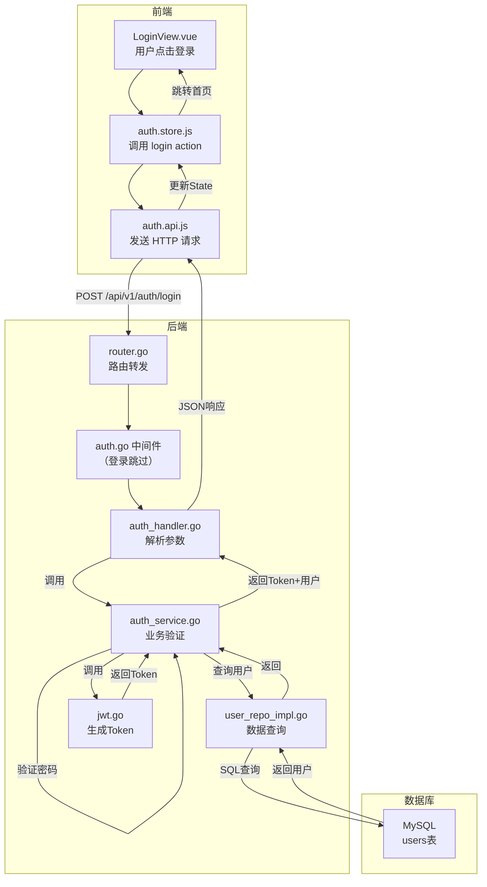

# 用户登录/注册 - 各层代码示例

以用户登录和注册功能为例，展示从后端到前端各层的完整代码实现：

---

## 一、后端代码

### 1. Domain 层 - 领域模型

```go
// backend/internal/domain/user.go
package domain

import "time"

type User struct {
    ID          uint      `json:"id"`
    Username    string    `json:"username"`
    Password    string    `json:"-"`                 // 不序列化到JSON
    RealName    string    `json:"realName"`
    Role        int       `json:"role"`              // 1:员工 2:管理员
    Status      int       `json:"status"`            // 1:启用 0:禁用
    LastLoginAt *time.Time `json:"lastLoginAt"`
    CreatedAt   time.Time `json:"createdAt"`
    UpdatedAt   time.Time `json:"updatedAt"`
}
```

---

### 2. Model 层 - GORM 映射

```go
// backend/internal/model/gorm_models.go
package model

import "time"

type GormUser struct {
    ID           uint      `gorm:"primaryKey"`
    Username     string    `gorm:"uniqueIndex;size:50;not null"`
    PasswordHash string    `gorm:"column:password_hash;size:255;not null"`
    RealName     string    `gorm:"size:50"`
    Role         int       `gorm:"default:1"`
    Status       int       `gorm:"default:1"`
    LastLoginAt  *time.Time
    CreatedAt    time.Time `gorm:"autoCreateTime"`
    UpdatedAt    time.Time `gorm:"autoUpdateTime"`
}

func (GormUser) TableName() string {
    return "users"
}
```

---

### 3. Repository 层

**接口定义：**

```go
// backend/internal/repository/interface/user_repo.go
package repository

import (
    "internet-cafe-system/backend/internal/domain"
)

type UserRepository interface {
    Create(user *domain.User, passwordHash string) error
    GetByID(id uint) (*domain.User, error)
    GetByUsername(username string) (*domain.User, error)
    GetPasswordHash(username string) (string, error)
    UpdateLastLogin(id uint) error
}
```

**具体实现：**

```go
// backend/internal/repository/impl/user_repo_impl.go
package impl

import (
    "errors"
    "time"
    
    "gorm.io/gorm"
    
    "internet-cafe-system/backend/internal/domain"
    "internet-cafe-system/backend/internal/model"
    rep "internet-cafe-system/backend/internal/repository/interface"
)

type UserRepositoryImpl struct {
    db *gorm.DB
}

func NewUserRepository(db *gorm.DB) rep.UserRepository {
    return &UserRepositoryImpl{db: db}
}

// Create 创建用户
func (r *UserRepositoryImpl) Create(user *domain.User, passwordHash string) error {
    gormUser := &model.GormUser{
        Username:     user.Username,
        PasswordHash: passwordHash,
        RealName:     user.RealName,
        Role:         user.Role,
        Status:       1,
    }
    return r.db.Create(gormUser).Error
}

// GetByUsername 根据用户名查询
func (r *UserRepositoryImpl) GetByUsername(username string) (*domain.User, error) {
    var gormUser model.GormUser
    if err := r.db.Where("username = ?", username).First(&gormUser).Error; err != nil {
        if errors.Is(err, gorm.ErrRecordNotFound) {
            return nil, nil
        }
        return nil, err
    }
    return r.toDomain(&gormUser), nil
}

// GetPasswordHash 获取密码哈希（用于登录验证）
func (r *UserRepositoryImpl) GetPasswordHash(username string) (string, error) {
    var gormUser model.GormUser
    if err := r.db.Select("password_hash").Where("username = ?", username).First(&gormUser).Error; err != nil {
        if errors.Is(err, gorm.ErrRecordNotFound) {
            return "", nil
        }
        return "", err
    }
    return gormUser.PasswordHash, nil
}

// UpdateLastLogin 更新最后登录时间
func (r *UserRepositoryImpl) UpdateLastLogin(id uint) error {
    now := time.Now()
    return r.db.Model(&model.GormUser{}).Where("id = ?", id).Update("last_login_at", now).Error
}

// toDomain GORM → Domain 转换
func (r *UserRepositoryImpl) toDomain(g *model.GormUser) *domain.User {
    return &domain.User{
        ID:          g.ID,
        Username:    g.Username,
        RealName:    g.RealName,
        Role:        g.Role,
        Status:      g.Status,
        LastLoginAt: g.LastLoginAt,
        CreatedAt:   g.CreatedAt,
        UpdatedAt:   g.UpdatedAt,
    }
}
```

---

### 4. Service 层 - 业务逻辑

```go
// backend/internal/service/auth_service.go
package service

import (
    "errors"
    "time"
    
    "internet-cafe-system/backend/internal/domain"
    "internet-cafe-system/backend/internal/pkg/crypto"
    "internet-cafe-system/backend/internal/pkg/jwt"
    rep "internet-cafe-system/backend/internal/repository/interface"
)

type AuthService struct {
    userRepo rep.UserRepository
    jwtSecret string
    jwtExpire int
}

func NewAuthService(userRepo rep.UserRepository, jwtSecret string, jwtExpire int) *AuthService {
    return &AuthService{
        userRepo:   userRepo,
        jwtSecret:  jwtSecret,
        jwtExpire:  jwtExpire,
    }
}

// ============ 注册 ============
type RegisterRequest struct {
    Username string `json:"username"`
    Password string `json:"password"`
    RealName string `json:"realName"`
}

func (s *AuthService) Register(req *RegisterRequest) (*domain.User, error) {
    // 1. 检查用户名是否已存在
    existing, err := s.userRepo.GetByUsername(req.Username)
    if err != nil {
        return nil, err
    }
    if existing != nil {
        return nil, errors.New("用户名已存在")
    }
    
    // 2. 密码加密
    passwordHash, err := crypto.HashPassword(req.Password)
    if err != nil {
        return nil, errors.New("密码加密失败")
    }
    
    // 3. 创建用户
    user := &domain.User{
        Username: req.Username,
        RealName: req.RealName,
        Role:     1, // 默认普通员工
        Status:   1, // 默认启用
    }
    
    if err := s.userRepo.Create(user, passwordHash); err != nil {
        return nil, err
    }
    
    return user, nil
}

// ============ 登录 ============
type LoginRequest struct {
    Username string `json:"username"`
    Password string `json:"password"`
}

type LoginResponse struct {
    AccessToken string       `json:"accessToken"`
    User        *domain.User `json:"user"`
}

func (s *AuthService) Login(req *LoginRequest) (*LoginResponse, error) {
    // 1. 查询用户
    user, err := s.userRepo.GetByUsername(req.Username)
    if err != nil {
        return nil, err
    }
    if user == nil {
        return nil, errors.New("用户名或密码错误")
    }
    
    // 2. 检查用户状态
    if user.Status == 0 {
        return nil, errors.New("账号已被禁用")
    }
    
    // 3. 验证密码
    passwordHash, err := s.userRepo.GetPasswordHash(req.Username)
    if err != nil {
        return nil, err
    }
    if !crypto.CheckPasswordHash(req.Password, passwordHash) {
        return nil, errors.New("用户名或密码错误")
    }
    
    // 4. 生成 JWT Token
    token, err := jwt.GenerateToken(user.ID, user.Username, user.Role, s.jwtSecret, s.jwtExpire)
    if err != nil {
        return nil, errors.New("生成Token失败")
    }
    
    // 5. 更新最后登录时间（异步，忽略错误）
    _ = s.userRepo.UpdateLastLogin(user.ID)
    
    return &LoginResponse{
        AccessToken: token,
        User:        user,
    }, nil
}
```

---

### 5. 工具包 - 加密 & JWT

```go
// backend/internal/pkg/crypto/bcrypt.go
package crypto

import "golang.org/x/crypto/bcrypt"

// HashPassword 加密密码
func HashPassword(password string) (string, error) {
    bytes, err := bcrypt.GenerateFromPassword([]byte(password), bcrypt.DefaultCost)
    return string(bytes), err
}

// CheckPasswordHash 验证密码
func CheckPasswordHash(password, hash string) bool {
    err := bcrypt.CompareHashAndPassword([]byte(hash), []byte(password))
    return err == nil
}
```

```go
// backend/internal/pkg/jwt/jwt.go
package jwt

import (
    "time"
    "github.com/golang-jwt/jwt/v5"
)

type Claims struct {
    UserID   uint   `json:"userId"`
    Username string `json:"username"`
    Role     int    `json:"role"`
    jwt.RegisteredClaims
}

// GenerateToken 生成JWT
func GenerateToken(userID uint, username string, role int, secret string, expireMinutes int) (string, error) {
    claims := Claims{
        UserID:   userID,
        Username: username,
        Role:     role,
        RegisteredClaims: jwt.RegisteredClaims{
            ExpiresAt: jwt.NewNumericDate(time.Now().Add(time.Duration(expireMinutes) * time.Minute)),
            IssuedAt:  jwt.NewNumericDate(time.Now()),
        },
    }
    
    token := jwt.NewWithClaims(jwt.SigningMethodHS256, claims)
    return token.SignedString([]byte(secret))
}

// ParseToken 解析JWT
func ParseToken(tokenString, secret string) (*Claims, error) {
    token, err := jwt.ParseWithClaims(tokenString, &Claims{}, func(token *jwt.Token) (interface{}, error) {
        return []byte(secret), nil
    })
    
    if err != nil {
        return nil, err
    }
    
    if claims, ok := token.Claims.(*Claims); ok && token.Valid {
        return claims, nil
    }
    
    return nil, errors.New("无效的Token")
}
```

---

### 6. Handler 层 - 控制器

```go
// backend/internal/handler/v1/auth_handler.go
package handler

import (
    "net/http"
    
    "github.com/gin-gonic/gin"
    
    "internet-cafe-system/backend/internal/service"
)

type AuthHandler struct {
    authService *service.AuthService
}

func NewAuthHandler(authService *service.AuthService) *AuthHandler {
    return &AuthHandler{authService: authService}
}

// ============ 注册接口 ============
func (h *AuthHandler) Register(c *gin.Context) {
    var req service.RegisterRequest
    
    // 1. 绑定JSON并校验
    if err := c.ShouldBindJSON(&req); err != nil {
        c.JSON(http.StatusBadRequest, gin.H{
            "code":    400,
            "message": "参数错误: " + err.Error(),
        })
        return
    }
    
    // 2. 调用Service
    user, err := h.authService.Register(&req)
    if err != nil {
        c.JSON(http.StatusBadRequest, gin.H{
            "code":    400,
            "message": err.Error(),
        })
        return
    }
    
    // 3. 返回成功响应
    c.JSON(http.StatusOK, gin.H{
        "code":    0,
        "message": "注册成功",
        "data":    user,
    })
}

// ============ 登录接口 ============
func (h *AuthHandler) Login(c *gin.Context) {
    var req service.LoginRequest
    
    // 1. 绑定JSON并校验
    if err := c.ShouldBindJSON(&req); err != nil {
        c.JSON(http.StatusBadRequest, gin.H{
            "code":    400,
            "message": "参数错误: " + err.Error(),
        })
        return
    }
    
    // 2. 调用Service
    result, err := h.authService.Login(&req)
    if err != nil {
        c.JSON(http.StatusUnauthorized, gin.H{
            "code":    401,
            "message": err.Error(),
        })
        return
    }
    
    // 3. 返回成功响应
    c.JSON(http.StatusOK, gin.H{
        "code":    0,
        "message": "登录成功",
        "data":    result,
    })
}
```

---

### 7. 中间件 - JWT 验证

```go
// backend/internal/middleware/auth.go
package middleware

import (
    "net/http"
    "strings"
    
    "github.com/gin-gonic/gin"
    
    "internet-cafe-system/backend/internal/pkg/jwt"
)

func Auth(jwtSecret string) gin.HandlerFunc {
    return func(c *gin.Context) {
        // 1. 从Header获取Token
        authHeader := c.GetHeader("Authorization")
        if authHeader == "" {
            c.JSON(http.StatusUnauthorized, gin.H{
                "code":    401,
                "message": "未提供认证令牌",
            })
            c.Abort()
            return
        }
        
        // 2. 解析Token (Bearer xxx)
        parts := strings.SplitN(authHeader, " ", 2)
        if len(parts) != 2 || parts[0] != "Bearer" {
            c.JSON(http.StatusUnauthorized, gin.H{
                "code":    401,
                "message": "认证格式错误",
            })
            c.Abort()
            return
        }
        
        // 3. 验证Token
        claims, err := jwt.ParseToken(parts[1], jwtSecret)
        if err != nil {
            c.JSON(http.StatusUnauthorized, gin.H{
                "code":    401,
                "message": "无效的认证令牌",
            })
            c.Abort()
            return
        }
        
        // 4. 将用户信息存入上下文
        c.Set("userID", claims.UserID)
        c.Set("username", claims.Username)
        c.Set("role", claims.Role)
        
        c.Next()
    }
}
```

---

### 8. 路由注册

```go
// backend/internal/router/router.go
package router

import (
    "github.com/gin-gonic/gin"
    
    "internet-cafe-system/backend/internal/handler/v1"
    "internet-cafe-system/backend/internal/middleware"
)

func SetupRouter(
    authHandler *handler.AuthHandler,
    jwtSecret string,
) *gin.Engine {
    r := gin.Default()
    
    // 全局中间件
    r.Use(middleware.CORS())
    
    // 健康检查
    r.GET("/ping", func(c *gin.Context) {
        c.JSON(200, gin.H{"message": "pong"})
    })
    
    api := r.Group("/api/v1")
    {
        // ====== 认证相关（无需登录） ======
        auth := api.Group("/auth")
        {
            auth.POST("/register", authHandler.Register)  // 注册
            auth.POST("/login", authHandler.Login)        // 登录
        }
        
        // ====== 需要登录的接口 ======
        protected := api.Group("/")
        protected.Use(middleware.Auth(jwtSecret))
        {
            protected.GET("/profile", authHandler.GetProfile)  // 获取个人信息
            // ... 其他需要登录的接口
        }
    }
    
    return r
}
```

---

## 二、前端代码

### 1. API 请求层

```javascript
// frontend/src/api/client.js - Axios 实例
import axios from 'axios'

const client = axios.create({
  baseURL: import.meta.env.VITE_API_BASE_URL || '/api/v1',
  timeout: 10000,
})

// 请求拦截器 - 自动添加Token
client.interceptors.request.use(
  (config) => {
    const token = localStorage.getItem('accessToken')
    if (token) {
      config.headers.Authorization = `Bearer ${token}`
    }
    return config
  },
  (error) => Promise.reject(error)
)

// 响应拦截器 - 统一错误处理
client.interceptors.response.use(
  (response) => {
    // 统一响应格式: { code, message, data }
    const res = response.data
    if (res.code !== 0) {
      return Promise.reject(new Error(res.message || '请求失败'))
    }
    return res.data
  },
  (error) => {
    if (error.response?.status === 401) {
      // Token过期，跳转登录
      localStorage.removeItem('accessToken')
      localStorage.removeItem('user')
      window.location.href = '/login'
    }
    return Promise.reject(error)
  }
)

export default client
```

```javascript
// frontend/src/api/auth.api.js - 认证接口
import client from './client'

export const authApi = {
  // 注册
  register(data) {
    return client.post('/auth/register', data)
  },
  
  // 登录
  login(data) {
    return client.post('/auth/login', data)
  },
  
  // 获取个人信息
  getProfile() {
    return client.get('/profile')
  },
  
  // 登出
  logout() {
    return client.post('/auth/logout')
  }
}
```

---

### 2. Store 状态管理

```javascript
// frontend/src/stores/auth.store.js
import { defineStore } from 'pinia'
import { ref, computed } from 'vue'
import { authApi } from '@/api/auth.api'

export const useAuthStore = defineStore('auth', () => {
  // ====== State ======
  const user = ref(null)
  const token = ref(localStorage.getItem('accessToken') || '')
  const isLoading = ref(false)

  // ====== Getters ======
  const isLoggedIn = computed(() => !!token.value && !!user.value)
  const isAdmin = computed(() => user.value?.role === 2)

  // ====== Actions ======

  // 注册
  async function register(data) {
    isLoading.value = true
    try {
      const result = await authApi.register(data)
      return { success: true, data: result }
    } catch (error) {
      return { success: false, message: error.message }
    } finally {
      isLoading.value = false
    }
  }

  // 登录
  async function login(data) {
    isLoading.value = true
    try {
      const result = await authApi.login(data)
      
      // 保存Token和用户信息
      token.value = result.accessToken
      user.value = result.user
      
      localStorage.setItem('accessToken', result.accessToken)
      localStorage.setItem('user', JSON.stringify(result.user))
      
      return { success: true }
    } catch (error) {
      return { success: false, message: error.message }
    } finally {
      isLoading.value = false
    }
  }

  // 登出
  function logout() {
    token.value = ''
    user.value = null
    localStorage.removeItem('accessToken')
    localStorage.removeItem('user')
  }

  // 从本地存储恢复登录状态
  function restoreSession() {
    const storedUser = localStorage.getItem('user')
    if (storedUser && token.value) {
      try {
        user.value = JSON.parse(storedUser)
      } catch {
        logout()
      }
    }
  }

  // 初始化时恢复
  restoreSession()

  return {
    user,
    token,
    isLoading,
    isLoggedIn,
    isAdmin,
    register,
    login,
    logout,
    restoreSession,
  }
})
```

---

### 3. 登录页面组件

```vue
<!-- frontend/src/views/LoginView.vue -->
<template>
  <div class="login-container">
    <div class="login-card">
      <div class="login-header">
        <h1>网吧管理系统</h1>
        <p>{{ isRegister ? '注册新账号' : '登录' }}</p>
      </div>

      <!-- 表单 -->
      <el-form
        ref="formRef"
        :model="form"
        :rules="rules"
        label-width="0"
        @submit.prevent="handleSubmit"
      >
        <el-form-item prop="username">
          <el-input
            v-model="form.username"
            placeholder="请输入用户名"
            prefix-icon="User"
            size="large"
          />
        </el-form-item>

        <el-form-item prop="password">
          <el-input
            v-model="form.password"
            type="password"
            placeholder="请输入密码"
            prefix-icon="Lock"
            size="large"
            show-password
          />
        </el-form-item>

        <!-- 注册时显示确认密码 -->
        <el-form-item v-if="isRegister" prop="confirmPassword">
          <el-input
            v-model="form.confirmPassword"
            type="password"
            placeholder="请确认密码"
            prefix-icon="Lock"
            size="large"
            show-password
          />
        </el-form-item>

        <!-- 注册时显示真实姓名 -->
        <el-form-item v-if="isRegister" prop="realName">
          <el-input
            v-model="form.realName"
            placeholder="请输入真实姓名"
            prefix-icon="User"
            size="large"
          />
        </el-form-item>

        <el-form-item>
          <el-button
            type="primary"
            native-type="submit"
            size="large"
            :loading="authStore.isLoading"
            style="width: 100%"
          >
            {{ isRegister ? '注册' : '登录' }}
          </el-button>
        </el-form-item>

        <!-- 切换登录/注册 -->
        <div class="toggle-link">
          <span v-if="isRegister">已有账号？</span>
          <span v-else>还没有账号？</span>
          <el-link type="primary" @click="toggleMode">
            {{ isRegister ? '去登录' : '去注册' }}
          </el-link>
        </div>
      </el-form>
    </div>
  </div>
</template>

<script setup>
import { ref, reactive, computed } from 'vue'
import { useRouter, useRoute } from 'vue-router'
import { ElMessage } from 'element-plus'
import { useAuthStore } from '@/stores/auth.store'

const router = useRouter()
const route = useRoute()
const authStore = useAuthStore()

// ====== 状态 ======
const isRegister = ref(false)
const formRef = ref(null)

const form = reactive({
  username: '',
  password: '',
  confirmPassword: '',
  realName: '',
})

// ====== 表单校验规则 ======
const rules = computed(() => ({
  username: [
    { required: true, message: '请输入用户名', trigger: 'blur' },
    { min: 3, max: 20, message: '用户名长度为3-20位', trigger: 'blur' }
  ],
  password: [
    { required: true, message: '请输入密码', trigger: 'blur' },
    { min: 6, max: 30, message: '密码长度为6-30位', trigger: 'blur' }
  ],
  confirmPassword: isRegister.value ? [
    { required: true, message: '请确认密码', trigger: 'blur' },
    {
      validator: (rule, value, callback) => {
        if (value !== form.password) {
          callback(new Error('两次输入的密码不一致'))
        } else {
          callback()
        }
      },
      trigger: 'blur'
    }
  ] : [],
  realName: isRegister.value ? [
    { required: true, message: '请输入真实姓名', trigger: 'blur' }
  ] : [],
}))

// ====== 方法 ======
function toggleMode() {
  isRegister.value = !isRegister.value
  // 切换时清空表单
  form.username = ''
  form.password = ''
  form.confirmPassword = ''
  form.realName = ''
}

async function handleSubmit() {
  // 表单校验
  const valid = await formRef.value?.validate().catch(() => false)
  if (!valid) return

  if (isRegister.value) {
    // ====== 注册 ======
    const result = await authStore.register({
      username: form.username,
      password: form.password,
      realName: form.realName,
    })
    
    if (result.success) {
      ElMessage.success('注册成功，请登录')
      toggleMode() // 切换到登录模式
      form.password = ''
      form.confirmPassword = ''
    } else {
      ElMessage.error(result.message || '注册失败')
    }
  } else {
    // ====== 登录 ======
    const result = await authStore.login({
      username: form.username,
      password: form.password,
    })
    
    if (result.success) {
      ElMessage.success('登录成功')
      // 跳转到之前访问的页面或首页
      const redirect = route.query.redirect || '/'
      router.push(redirect)
    } else {
      ElMessage.error(result.message || '登录失败')
    }
  }
}
</script>

<style scoped>
.login-container {
  display: flex;
  justify-content: center;
  align-items: center;
  min-height: 100vh;
  background: linear-gradient(135deg, #667eea 0%, #764ba2 100%);
}

.login-card {
  width: 400px;
  padding: 40px;
  background: white;
  border-radius: 12px;
  box-shadow: 0 10px 40px rgba(0, 0, 0, 0.2);
}

.login-header {
  text-align: center;
  margin-bottom: 30px;
}

.login-header h1 {
  font-size: 24px;
  color: #333;
  margin-bottom: 8px;
}

.login-header p {
  color: #999;
  font-size: 14px;
}

.toggle-link {
  text-align: center;
  font-size: 14px;
  color: #666;
  margin-top: 16px;
}
</style>
```

---

### 4. 路由配置

```javascript
// frontend/src/router/index.js
import { createRouter, createWebHistory } from 'vue-router'
import { useAuthStore } from '@/stores/auth.store'

const routes = [
  {
    path: '/login',
    name: 'Login',
    component: () => import('@/views/LoginView.vue'),
    meta: { requiresGuest: true }, // 未登录才能访问
  },
  {
    path: '/',
    component: () => import('@/layouts/MainLayout.vue'),
    meta: { requiresAuth: true },
    children: [
      {
        path: '',
        redirect: '/dashboard'
      },
      {
        path: 'dashboard',
        component: () => import('@/views/DashboardView.vue'),
      },
      // ... 其他需要登录的路由
    ]
  }
]

const router = createRouter({
  history: createWebHistory(),
  routes,
})

// ====== 导航守卫 ======
router.beforeEach((to, from, next) => {
  const authStore = useAuthStore()
  
  // 需要登录
  if (to.meta.requiresAuth) {
    if (!authStore.isLoggedIn) {
      next({
        path: '/login',
        query: { redirect: to.fullPath }
      })
      return
    }
  }
  
  // 游客才能访问（如登录页）
  if (to.meta.requiresGuest) {
    if (authStore.isLoggedIn) {
      next('/')
      return
    }
  }
  
  next()
})

export default router
```

---

## 三、数据流转图



---

这就是实现登录/注册功能时，各层完整的代码样式。整个流程遵循：

**后端**：Handler → Service → Repository → Domain → 数据库  
**前端**：View → Store → API → 后端

每一层各司其职，清晰分离。