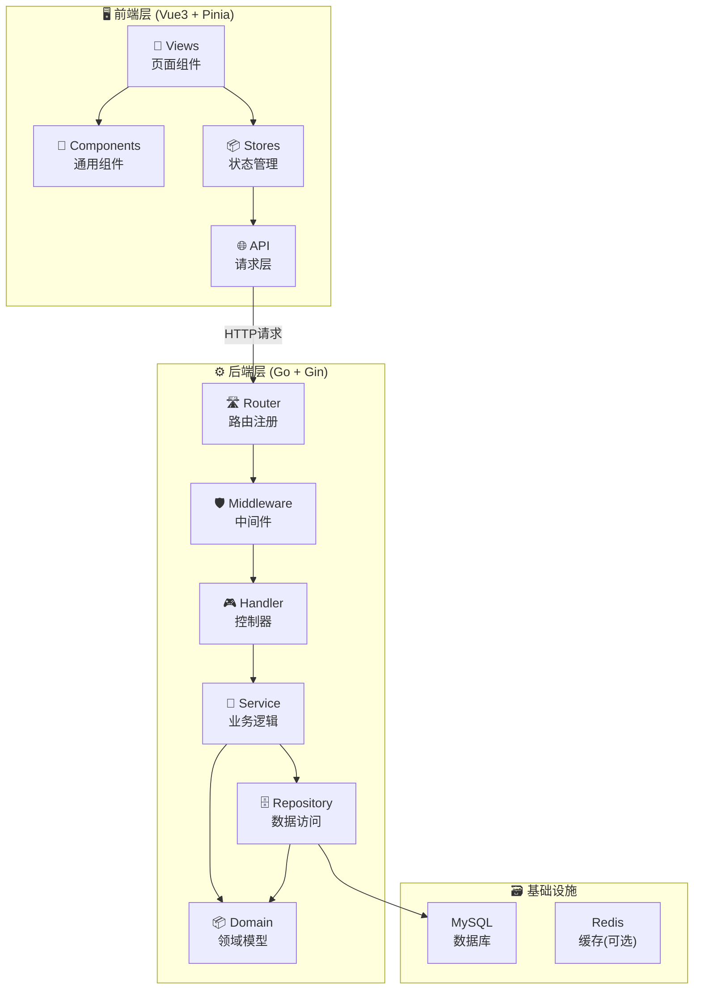
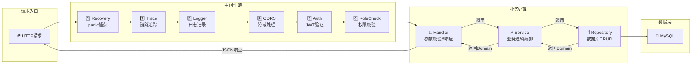
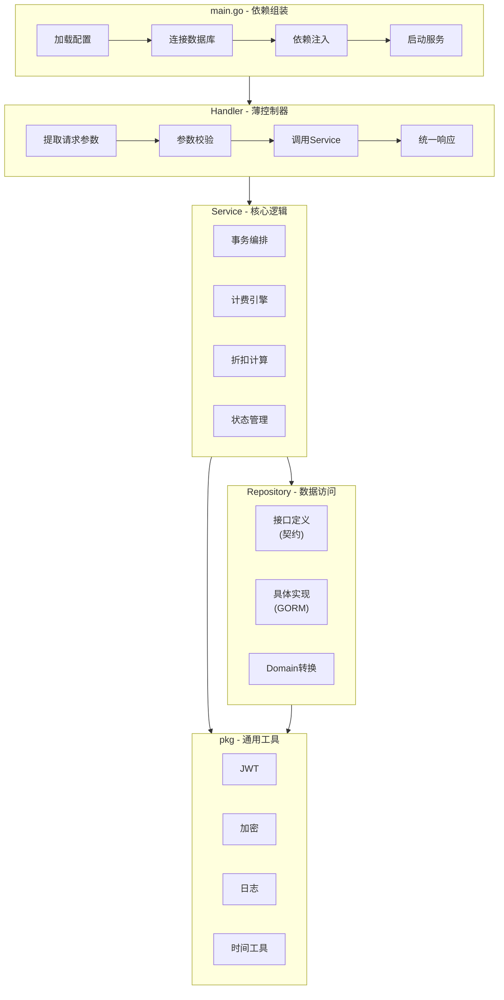
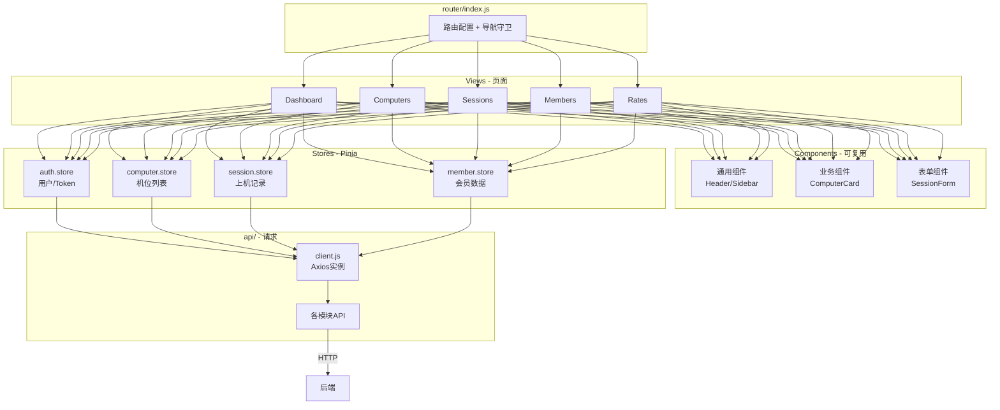
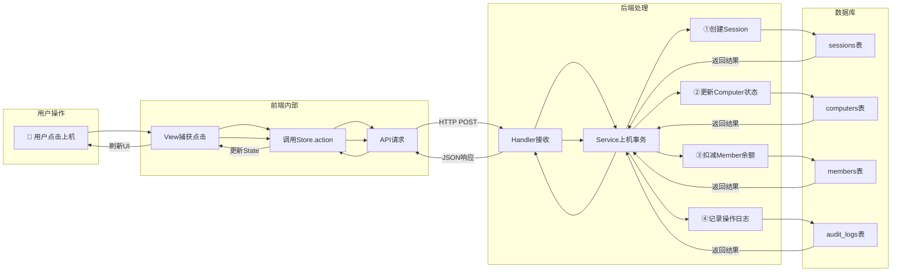
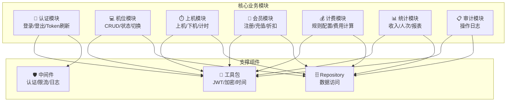
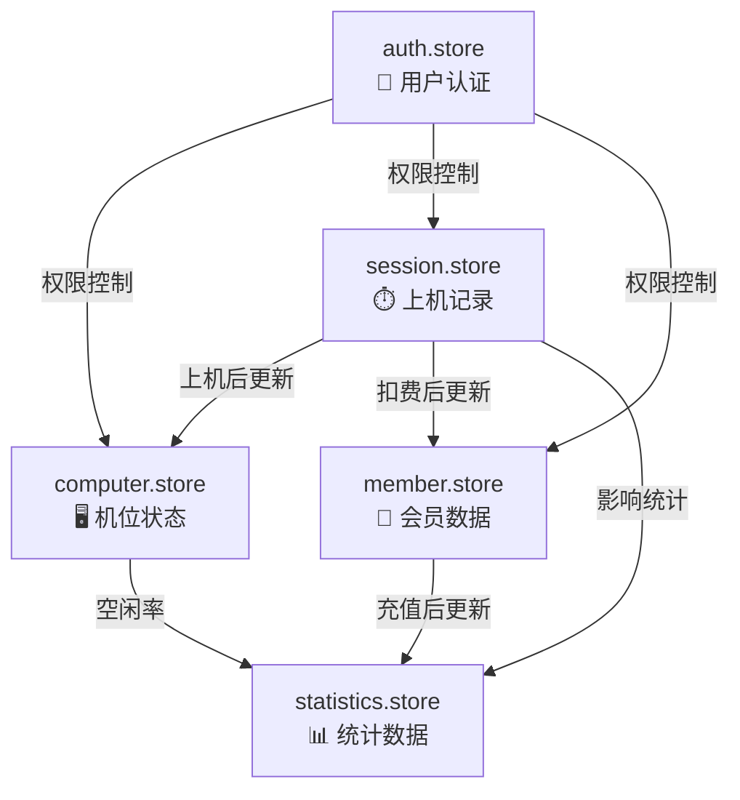

# 项目框架核心流程图

基于你提供的文档，我用流程图直观展示这个网吧管理系统的整体架构和各层职责：

---

## 一、整体架构分层图（核心）

---

## 二、后端请求处理流程（从HTTP到数据库）

---

## 三、各层职责与依赖关系（详细）

---

## 四、前端架构分层图

---

## 五、数据流转图（以上机功能为例）

---

## 六、核心模块功能图谱

---

## 七、前端状态管理（Store）关系图

---

这些流程图覆盖了：
- **整体架构分层**
- **请求处理流程**
- **各层职责边界**
- **数据流转路径**
- **模块功能关系**
- **前端状态管理**

你可以根据开发进度，在需要深入的地方（如计费引擎算法、事务处理细节）继续展开。